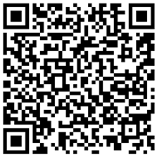

 

# PCTB - Python Crypto Trading Bot (v1.0)
___

This [repository](https://github.com/yzgastk/python_crypto_trading_bot), contains a trading bot written in python (v3.8) for Binance. It is distributed under GPLv3.0 licence.
It provides a framework to test strategies on live data in a fully controllable environment (e.g.). The main interest of this framework is to test different trading strategies
 and to be able to paper trade before going live.

## Install
### *nix based
First, check that you have the following dependencies installed:
- [TA-Lib](https://mrjbq7.github.io/ta-lib/) (not mandatory)
- pip dependencies : `pip3 install -r requirements.txt`

Then, download or git clone the project, and you are ready to go!
### Dockerfile
You can also use the Dockerfile to build a working container. First, go inside the project folder, then :
`sudo docker build -t pctb:Dockerfile .`

Then you can work inside the container using : `sudo docker run -it pctb:Dockerfile`. It will get you inside the project folder.

You can use `python3 main.py` to see if everything is working correctly.
## Usage
Run the script with `python3 main.py` and the basic example should start. The script can take the following arguments:
- -t, --timeframe: The timeframe  (type: string | default: "15m")
- -u, --runUntil: (type: datetime.fromisoformat | default: now() + 1 day)
- -s, --symbols: (type: string | default: "./symbol_list.csv")

## Features
- Candlesticks
- HeikinAshi
- Wallets & Orders for paper trading
- Custom Indicators (+ Ichimoku Cloud)
- Custom strategies
- Moving stop-losses

## Project Structure
```
/
/outputs          # Root folder of the project
/outputs/graphs/  # Folder containing the output files generated by the bot
/outputs/logs/    # Regroup logs - One log generated by run
/.gitignore       # List of files excluded from the git repository
/BinanceAPI.py    # Class used as interface between bot internal logic and binance API
/clean_log.sh     # Script to delete files from ./outputs, keeping folder structure
/gpl-3-licence.md # Full version of GPLv3 Licence
/indicators.py    # Module regrouping computation of technical indicators
/Klines.py        # Class that retreives data from exchanges 
/main.py          # Main script containing working examples
/Orders.py        # Class used to store orders 
/README.md        # File containing extended desciption of this project
/requirements.py  # List of all pip modules used for the project
/statistics.py    # Module embedding functions that compute statistical metrics
/strategies.py    # Module regrouping different strategies to deploy while the bot is running
/TODO.md          # List of tasks to complete or improve the project
/WalletManager.py # Class keeping track of the different wallets
/Wallets.py       # Class responsible for coordinating orders and funds
```

## Interactions between modules
 


## Other Information
### Documentation
The code is pretty short, simple and verbose. In case you need more information, do not hesitate to contact me. In case
people show an interest, I will consider extending the documentation.
### TA-Lib
The examples given in the project use TA-Lib. If you do not want or cannot install it, you can safely remove occurences of `talib` from the
code and implement your own indicators.
### Other exchanges
Currently, I do not plan to plug other exchanges. However, if people are interested I can add an interface with [CCXT](https://github.com/ccxt/ccxt).
### Approximations
To simplify coding, I made a few approximations:
- USDT is considered equivalent to USD
- The most expensive commission is always used (commission_fee_taker)
- Minimal safeguards in case of error codes from binance API
### BinanceApi.py
This module should not be used. I left it in the project because it gives some examples on how to push orders on Binance
using a set of public/private key and how to construct "valid" request (which is not trivial).


## Contact
olivier.decourbe@protonmail.com

## Future of the project
This project is considered on hold until there is an emerging interest from the community.
Still, I will look at opened issues and try to answer questions that may arise.

## Donation
BTC Address : 3D1x1LZgSDiHTrtmuiyJkgVNskDi2jmgpx

 

Tether Address : 0x226711865b5051C8Db322C64649156BC0491c592

 

Dai Address : 0x628d0b5ffA6548DdDd268Ad00788bC5090b23c48


